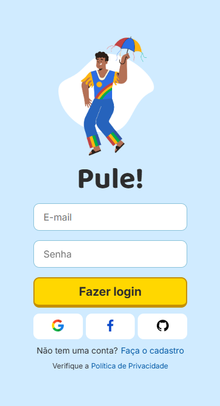
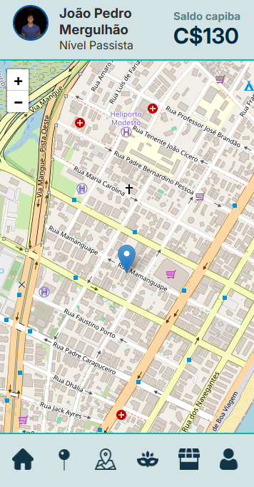
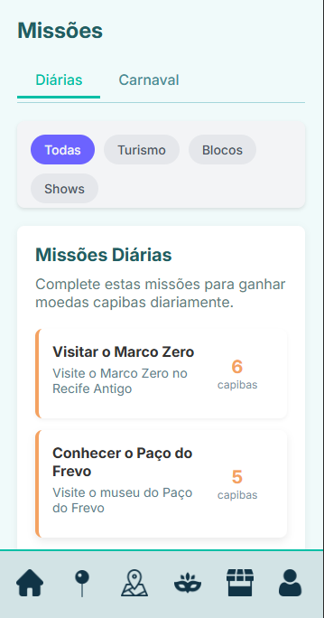

# Pule! - Gamified Carnival Engagement App

🇧🇷 **App available in Portuguese only**

🏆 **First Place at Unicap Innovation Saturday**

**Pule!** is a prototype gamified app designed to enhance engagement during Recife's Carnival. By completing challenges and exploring the city, users earn **Capiba Coins**, a virtual currency inspired by local culture, which can be exchanged for real-life rewards. The app was developed during the Unicap Innovation Saturday event, where our team secured **first place!** 🎉

---

## 🚀 Features

- 🎯 **Missions & Challenges:** Location-based and event-related challenges throughout Carnival.
- 🗺️ **Interactive Map:** Built with Leaflet.js, displaying real-time mission locations and user position.
- 🎁 **Rewards System:** Exchange Capiba Coins for exclusive prizes and discounts.
- 🧭 **Geolocation Support:** Tracks user location to unlock missions and recommend nearby activities.
- 📅 **Live Schedule Integration:** Displays the official event lineup, helping users plan their route and complete time-based missions.
- 📱 **Mobile-First Design:** Optimized for seamless use on mobile devices.
- 🎭 **Carnival Integration:** Immersive experience tailored to Recife’s vibrant Carnival atmosphere.

---

## 🛠️ Technologies Used

- **React** – Frontend framework
- **React Router** – SPA navigation
- **Leaflet.js** – Interactive maps
- **Firebase** – Authentication & database
- **Framer Motion** – Animations
- **bcrypt.js** – Password encryption
- **EmailAuthProvider (Firebase)** – Account re-authentication
- **HTML, CSS, JavaScript** – Core web technologies

---

## 🌐 Language Support

> 🔸 The app is currently available **only in Portuguese**, as it is designed specifically for the local audience of Recife’s Carnival.

---

## 📷 Screenshots

### Home Screen


### Map Screen


### Missions Screen


---

## 📲 Installation & Usage

### Prerequisites

Make sure you have **Node.js** and **npm** installed. You can download them from [nodejs.org](https://nodejs.org/).

### Setup

```bash
# Clone the repository
git clone https://github.com/yourusername/pule.git
cd pule

# Install dependencies
npm install

# Start the development server
npm start

# Build for production
npm run build

## 📜 License

This project is for educational and prototype purposes only and is not intended for commercial use. All rights reserved.

