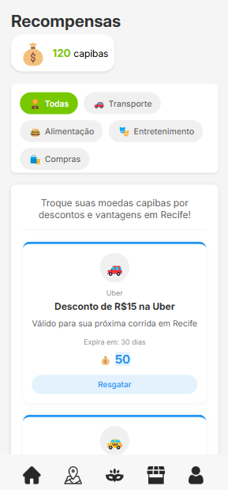

# Pule! - Gamified Carnival Engagement App

🏆 **First Place at Unicap Innovation Saturday**

Pule! is a prototype gamified app designed to enhance engagement during Recife's Carnival. By completing challenges and exploring the city, users earn **Capiba Coins**, a real local currency, which can be exchanged for rewards. The app was developed during the Unicap Innovation Saturday event, where our team secured **first place!** 🎉

## 🚀 Features

- 🎯 **Missions & Challenges:** Users complete location-based challenges to earn Capiba Coins.
- 🗺️ **Interactive Map:** Built with Leaflet.js to display mission locations dynamically.
- 🎁 **Rewards System:** Exchange Capiba Coins for exclusive perks.
- 📱 **Mobile-First Design:** Optimized for a seamless mobile experience.
- 🎭 **Carnival Integration:** Tailored for Recife’s vibrant Carnival atmosphere.

## 🛠️ Technologies Used

- **React** - Frontend framework
- **React Router** - Navigation management
- **Leaflet.js** - Interactive map rendering
- **HTML, CSS, JavaScript** - Core web technologies

## 📷 Screenshots

### Home Screen

git 
### Map Screen

git a
### Rewards Screen


## 📲 Installation & Usage

### Prerequisites

Make sure you have **Node.js** and **npm** installed. If not, download and install them from [nodejs.org](https://nodejs.org/).

### Setup

```sh
# Clone the repository
git clone https://github.com/yourusername/pule.git
cd pule

# Install dependencies
npm install

# Start the development server
npm start

# Build for Production
npm run build

## 📜 License

This project is for educational and prototype purposes only and is not intended for commercial use. All rights reserved.

